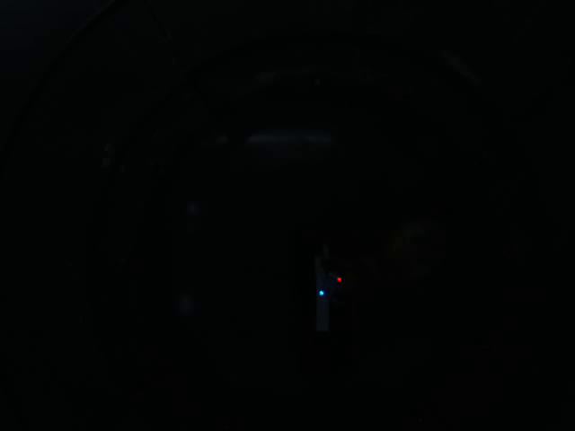
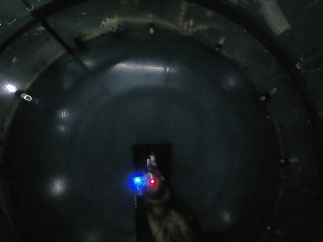

# Video Tracking

## 1. Objectives:
1. To go beyond the typical task structure and investigate the momentary behavior of animals in a way that captures the many cases where subjects respond prematurely (an indicator of impulsivity), visit multiple response spouts or take indirect paths to response locations.
2. To measure variables such as head speed and acceleration that may be important components in determining neural activity, particularly in regions beyond auditory cortex (e.g. parietal and prefrontal cortex).

TO DO:
Harmonise metadata with data/tables

---

## 2. Video formats

### 2.1. Dual Camera Strategy (*project start to 10 Jan 2018*)

Behavioral monitoring used two cameras: 
1. A Prosilica GC650C camera (Allied Vision Technologies) with a wide angle lens (1.8 mm 3.6 mm FL, Varifocal Video Lens, Edmund Optics) which communicated with a TDT RV2: All videos are 640 x 480 pixels and files contain the suffix "_Vid0.avi_"

2. A webcam with image acquisition controlled via matlab. The frame rate for these videos is lower than the container. 

### 2.2. Computer Capture (*29 Jan 2018 - project end*)

Towards the end of the project, we built a revised system that allowed us to link camera capture with TDT samples using Matlab. This removed the need for two separate video formats, leading to a single video and associated data file that contains TDT samples associated with each frame. While this synchronization isn't perfect, it's use of the TDT clock provides a level of validation that is better than previous methods as errors are do not accumulate over frames.

TO DO: Note (2022-08-31) that the metadata summary files do not include these videos, but should be extended to do so.

### 2.3. Metadata

Functions in this directory build an overview of the videos from the entire dataset (too large to host online) and link videos with calibration data.

[video_metadata.ipynb](./notebooks/video_metadata.ipynb)

---

## 3. Available Landmarks and Tracking

### 3.1. Available Landmarks

In all videos, red and blue LEDs placed on the recording headstage allow tracking of head position during testing. In high exposure videos, we can also label the nose, head (placed roughly at back, where the sagittal crest meets the rear ridge), mid-point between shoulder blades, midpoint between hips and the tail tip. (None of these landmarks were visible in the low exposure videos).

The placement of the LEDs was determined by the recording system and suboptimal, such that the blue channel is often out of view of the camera. Each color is also generated by two LEDs (one on the headstage, one on the battery), often leading to duplications in the signal. Together these limitations constrain the utility of the tracking in this project and require extensive correction and quality control. This is why visible marker are generally preferred for analysis.

*Note 1: It probably won't work, but it might be worth running some low exposure RV2 videos through the DLC model trained on high-exposure images, just in case the images contain something we can't see but the model can*

*Note 2: It may be possible to train a model to predict head direction from LED positions, treating the missing landmarks as an imputation problem in which RV2 videos with high exposure provide ground data.*

### 3.2. Tracking

Tracking was done via DeepLabCut (v.2.2.3), with separate models trained for tracking red and blue LEDs only (MODEL 1 LINK), or trained for tracking LEDs and anatomical landmarks such as head, nose etc. (MODEL 2 LINK). DeepLabCut includes an measure of the quality (likelihood) of each estimate that can be used for removing outliers (see Analysis)

We analysed each video using one of the models above and saved outputs in csv format. CSV files from multiple sessions analysed using the same model are collected using [compress_DLC_data.py](./../../data/arrow/compress_DLC_data.py) to create the following files:

| Type | Landmarks | File Name | Status | # of sessions | File Size |
| ---- | --------- | --------- | ------ | ------------- | --------- |
| High exposure | Head, nose, LEDs etc. | DLC_data_high_230213_0322.parquet | Incomplete | 118 | 0.6 GB |
| Low exposure | LEDs only | DLC_data_low_230213_0227.parquet | Complete | 385 | 0.5 GB |

The separate parquet files contain results from tracking of high and low exposure videos, and some of the metadata for videos acquired with the webcam (rather than RV2) cannot be accessed on that machine.

We therefore use a couple of supplementary scripts to 
1. Recover the relevant metadata for videos from the webcam ([add_missing_metadata_to_DLC.py](./../../../data/arrow/add_missing_metadata_to_DLC.py))
2. Comine results from high and low exposure videos, while putting placeholder values (zeros) for landmarks that aren't tracked in low exposure videos ([combine_parquet_files.py](./../../../data/arrow/combine_parquet_files.py))

This results in a single DLC file containing all the tracking results with the correct metadata. 

* DLC_combined_230214_2122.parquet

(Note that the size of this file could be reduced if we were to change the data types for tracking results - we don't really need sub-pixel accuracy)

## 4. [Calibration](./calibration/ReadMe.md)

Calibration refers to the alignment of behaviorally relevant landmarks within the camera image. Calibration images were taken at high exposure using the camera through which red and blue LEDs were tracked at low exposure. (Note that the low light levels in the chamber during testing mean that arena landmarks were rarely visible under low exposure).

 This is critical for interpretting LED positions, because the camera was moved at various points throughout the experiment (see below). The position of visual stimuli (and bounding boxes around them) is of particular interest, as pixel values in these regions can be used to aid synchronization.

### 4.1. Defining regions of interest

Take a calibration image and highlight regions of bounding boxes around the locations of visual stimuli. This was done using [select_spout_pixels.m](./calibration/select_spout_pixels.m) to place bounding boxes around regions of interest. Bounding box details are then stored as separate CSV files for each image with the lower left xy position, width and height of the box. 

CSV files for each image are then brought together using [get_bounding_boxes.py](./../../data/tables/get_bounding_boxes.py) to generate a single table that also includes calibration image name [bounding_boxes.csv](./../../data/tables/bounding_boxes.csv). The bounding boxes can be checked visually using the [draw_boundingbox_on_calib_image function in plotting.py](./plotting.py), which may be helpful in debugging later on.

<i>Note: For videos with TDT samples in images, we do not require bounding boxes to be defined</i>

### 4.2. Image registration

The position of the camera varied across the project such that a given pixel may cover different areas of the arena in different videos. To map tracking data onto a common reference frame, it is necessary to register the images to a common reference frame. 

The primary method for image registration uses intensity-based estimation via the <i>ecc_aligner</i> class in [registration.py](./registration.py) based on a Euclidean model of motion (3 degrees of freedom), however this approach does not always work (even when an alternative motion model such as Translation or Affine model). A second feature-based estimation class (<i>keypoint_aligner</i>) is also included in [registration.py](./registration.py) that estimates the homographic transformation (8 degrees of freedom) however this also fails in some of the same cases. A third alternative is to use the image registration toolbox in Matlab, implemented in [registerImages.m](./registerImages.m). If all other approaches fail, translation and rotation can be estimated manually.

The effects of registration are explored in the notebook [test_image_alignment.ipynb](./notebooks/test_image_alignment.ipynb), which highlights the benefits of registration. There are some questions about the way to use the warp transformation with tracking results that remain.

Heatmap of head positions in arena without alignment:
 
Same heatmap after applying registration...
 

For each calibration image, we store the affine transformation required for alignment with the template image (2016-04-29 10_31_56.jpg). We have yet to determine how to store the homographic transformation for late-stage videos taken with the webcam (i.e. those with TDT samples).

### 4.3. Full dataset
Calibration images and bounding boxes for regions of interest can be found on [figshare](https://www.figshare.com/articles/dataset/Head_tracking_calibration_images_and_bounding_boxes/20589633)

## 5. Synchronization

The process of aligining the timecourse of videos and other systems has it's own [documentation](./synchronization/ReadMe.md), however the broad steps can be summarised as:

1. Measure the average pixel intensity in bounding boxes (Section 4.1) around the time of visual stimulus presentation expected under constant FPS assumptions using [get_vis_stim_in_video.m](./get_vis_stim_in_video.m)
2. Estimate the error in timing of visual stimulus presentation due to dropped frames using [estimate_trial_onset_from_LED.py](./estimate_trial_onset_from_LED.py)
3. Optional refinement of estimates via linear regression and manual removal of erroneous estimates
4. Estimate ongoing frame rates as a time-varying function based on the duration of each trial and the number of dropped frames [(estimate_ongoing_fps.py)](./estimate_ongoing_fps.py)

A separate pipeline exists for a small number of videos at the end of the project, for which timestamps from the tdt clock are inserted directly into video frames and (in most cases) stored alongside as text files for analysis. For these videos, we can estimate the frame times relative to the tdt clock directly, using the device sample rate.

It should also be noted that 0.5% of videos cannot by synchronized because the sessions do not contain any visual or audiovisual stimuli. In these cases, we fall back to use the average frame rate measured across the course of the project.

The times of each frame of tracking data are estimated in [add_time_to_DLC_data.py](./synchronization/add_time_to_DLC_data.py) using the approaches above. The script takes as input the parquet file containing tracked data after spatial alignment and generates a new parquet file containing additional columns for frame and time.

## 6. Final Steps

With so many hours of video data, there are inevitably cases in which tracking estimates are wrong or landmarks are missing from videos (e.g. if the animal turned its head out of view or moved outside the camera). Linear interpolation of data with low likelihoods provides a simple but effective way to fill in small gaps

## 7. Known issues

### 7.1. Sessions without videos
It's also useful to note that several blocks are missing any video files. These cases can be identified by switching the join between tables listing sessions and videos from an inner join to a left join in [get_video_files.py](../../../data/tables/get_video_files.py) (around about line 86). This is not preserved in the code because the resulting file cannot then be uploaded to the database while using the video name as a primary key, and so the cases are listed here for reference:

| Ferret | Block |
| ------ | ----- |
| 1506 | J2-5 |
| 1517 | J2-2 |
| 1602 | J2-2 |
| 1517 | J2-8 |
| 1517 | J2-46 |
| 1605 | J5-30 |
| 1605 | J5-31 |
| 1613 | J5-23 |

### 7.2. Low exposure blocks without LEDs

'* ferret also wearing vest

F1506:
    J2-30 (battery disconnected after 50s, poor red signal only anyway)
F1607:
    J3-18*  2017-07-26 09:53:00.024
    J3-19*  2017-07-26 16:26:42.346
    J3-26*  2017-08-01 08:40:05.872
    J3-27*
    J3-28*  2017-08-02 09:51:10.666
    J3-36 
    J3-39 
    J3-42
    J3-43*
    J3-44
    J3-45
    J3-46
    J3-47  
    J3-51 
    J3-52*
    J3-53*  2017-08-10 09:06:16.334
    J3-54   2017-08-10 15:15:21.403
    J3-84
F1613:
    J3-49
    J5-24 (battery disconnects after 170 s)

### 7.3. No LEDs but high exposure video

Head measurements are still possible here

'* ferret also wearing vest

F1607
    J3-20*
    J3-21*
    J3-22*
    J3-23*

### 7.4. LEDs set to flash
F1506:
    J2-11 (red)
    J2-13 (red)
F1518
    J2-9 (blue)
    J2-44 (blue)

---

## [Obsolete] - Matlab Tracking Method

*The following code was originally used to track LEDs in Matlab, but has now been replaced by DeepLabCut (ST: Dec 2022)*

## X.0. Metadata

To get an overview of the project and the range of video attributes, we begin with [get_video_metadata.m](get_video_metadata.m) that generates the [video_metadata.csv](video_metadata.csv) table. This function assumes the tank-block structure on the host computer in which each block represents an individual test session, with the block directory containing the video to be processed. We obtain information for each video including:
- image width
- image height
- number of frames
- video duration
- path strings for later convenience

The metadata csv file is then extended to include:
- the date and time each block was acquired, as well as the most recent calibration image taken before recording. This is done using [add_calib_im_to_metadata.m](add_calib_im_to_metadata.m) and results are stored in the [video_metadata_extended.csv](video_metadata_extended.csv) file
- the number of shutter events, used to later calculate the number of dropped frames and compare with video duration. Shutter counts are added using [add_shutter_counts.m](add_shutter_counts.m) and stored in [video_metadata_shutterInterim.csv](video_metadata_shutterInterim.csv). The comparison between dropped frames and video duration is performed by [compare_frame_numbers.m](https://github.com/stephentown42/Task_Switching/blob/main/Behavior/VideoTracking/visualization/compare_frame_numbers.m).

### X.1. First Pass Extraction

#### X.1.1. Config file
The tracking configuration file [tracking_config.json](Methods/video_tracking/tracking_config.json) contains a number of directories and path definitions for reading / writing files to the host machine. This can be updated for specific hosts so that tracking can be performed on multiple computers (e.g. when each computer is processing a different set of videos to accelerate analysis). The configuration file also contains some global parameters that may need to be shared across machines / scripts.

#### X.1.2. Tracking by channel peak

LEDs are first tracked using [trackLEDs.m](Methods/video_tracking/trackLEDs.m) that returns an estimate of the *x* and *y* pixel position of red and blue LEDs on every frame of each video. LED centroids are estimated by fitting gaussian distributions to the marginal pixel intensities of modified color channel images. This works well for good conditions, but also allows poor tracking to be identified using the coefficients of the fitted guassians (i.e. the standard deviation and curve height). As this process is performed without initial quality control it's thus known as first-pass extraction.

#### X.1.3. Combination of data

Initial estimates for Red and Blue LED positions in each frame is stored in csv format, with one file per video. The initial output files contains a number of unnecessary columns / column names that are removed / formatted using [tidy_head_tracking_data.py](Methods/video_tracking/tidy_head_tracking_data.py). An example file is saved with the repo (e.g. [F1607_CifJif_Block_J3-119_Vid0_tidy.csv](data/sample/head_tracking/F1607_CifJif_Block_J3-119_Vid0_tidy.csv)). 

This cleaning process is now part of the combination of results files into a single parquet file ('data/arrow/compress_LED_data.py')

#### X.1.4. Relation to other methods

Tracking by channel peak skips the manual thresholding and blob detection used in past approaches for tracking. This allows automated extraction of data from videos and should be faster than requiring user interaction. The results are however likely to contain noise that the quality control step must exlude.

Data from other experiments suggests that DeepLabCut may be a more effective method for tracking LEDs. It may be advisable to switch to this approach in the future.

