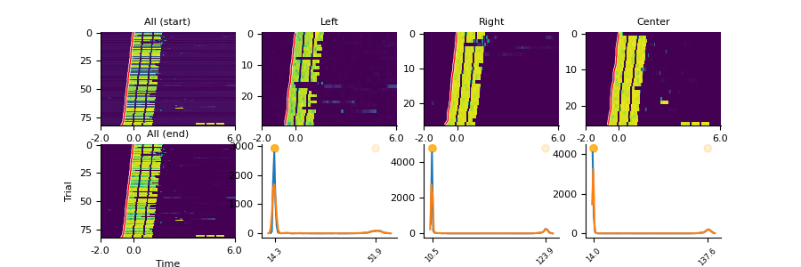
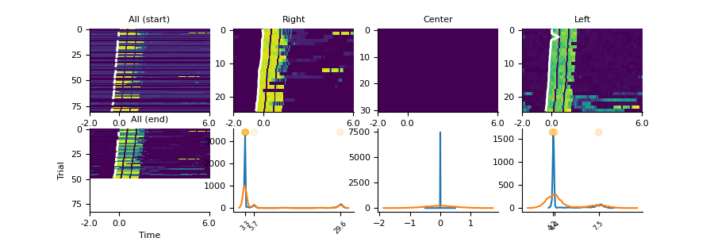
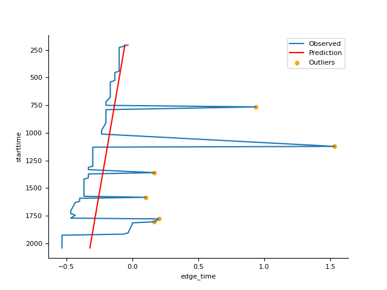
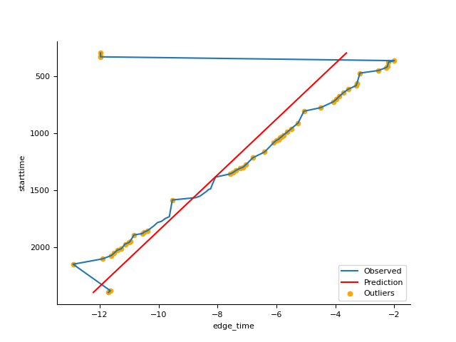
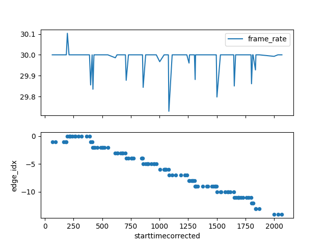
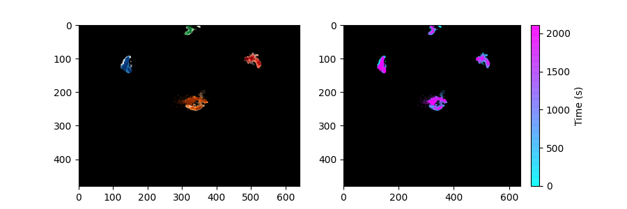
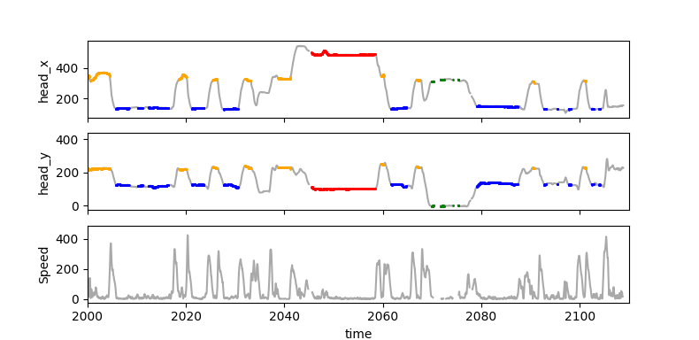

# Video Synchronization

## 1. Background: Inferring dropped frames from visual stimuli

We cannot assume that the frame rate of a camera is constant, as evidenced by the disparity between the number of frames in video files and the number of frames expected from the duration of behavioral blocks. This difference indicates that there are many dropped frames that occur at irregular intervals. 

The original plan was to use the native support for recording trigger pulses from the data acquisition system (RV2) to the camera to synchronize frame times with TDT data. However this system was found to be unable to detect missing frames (see [disavowed methods](##8)). The most reliable way to estimate frame times available to us is instead to use the visual stimuli presented to animals, under the assumption of a constant frame rate with randomly timed dropped frames. One can see evidence for dropped frames in the alignment of trial onset with LED signals in the video.

As the session begins, the time of the visual stimulus observed in the video is well aligned with that expected based on behavioral data. However over time, the onset of the visual stimulus occurs progressively earlier than expected.

*Generated as part of [estimate_trial_onset_from_LED.py](./estimate_trial_onset_from_LED.py)*

These problems occur because of frames dropped by the camera. If the synchronization was perfect, then when we predict that a stimulus should happen on frame 100, the signal from the video is well aligned. However when frames are dropped, an event predicted (on the basis of a constant frame rate) to occur in frame 100 actually occurs in frame 99, and so the signal in the video begins slightly earlier. As dropped frames aggregate, by the time we get to an event predicted to be in frame 1000, the 1000th frame is really frame 1010 (here I'm using 10 as an example, we don't actually know the value) and so the error is even larger.

The random and unreliable timing with which frames are dropped means that we cannot consider the frame rate of the camera to be constant. We must therefore estimate an **ongoing frame rate** between temporal landmarks. The figure below shows how this might vary across the trial: 

In an ideal world, the time between landmarks would be random and short (i.e. via a dedicated synchronization LED in the image; see the Spatial Coordinates project for example) however we don't have such reources here and must instead rely on the visual stimuli presented as part of the task as temporal markers:

## 2. Identifying dropped frames

### 2.1. Get the pixel values around the white LED around the time of visual stimulus presentation.

Reading from large video files and create small csv tables for each recording session. Note that some configuration settings need to be adjusted on a session-by-session basis (See Section 6.2 below for more information).

<b>Config</b>: [sync_config.json](./sync_config.json) 
<b>Scripts</b>: [get_vis_stim_in_video.m](./get_vis_stim_in_video.m), [get_video_data.m](./get_video_data.m) 
<b>Example Output</b>: [2017-10-12T09-18-28_Block_J3-119_level50_Auditory_CifJif.csv](./../../../data/sample/video_sync/StimTriggeredFrames/2017-10-12T09-18-28_Block_J3-119_level50_Auditory_CifJif.csv) 
<b>Full Output</b>: [FigShare](https://doi.org/10.6084/m9.figshare.20594736) <i>Needs updating (28-12-22)</i>

### 2.2. Estimating trial onset from visual signals using edge detection

Image normalization techniques are used to equate signals sampled from different bounding boxed around each visual stimulus location (line plots below). The normalized data are then combined across stimulus locations for canny edge detection. The results are often close to the required standard (white lines on heatmaps) and so are saved as csv files for optional refinement in later steps.

<b>Script</b>: [estimate_trial_onset_from_LED.py](./estimate_trial_onset_from_LED.py) 
<b>Example Output</b>: [F1613_Block_J4-13.csv](./../../../data/sample/video_sync/edge_detect/F1613_Block_J4-13.csv)

### 2.3. Remove outlier estimates of trial onset using regression (Optional)
Where results fall short of the required standard, it is often due to a small number of trials with unusual visual signals. These are so characteristic that it is possible to identify them as outliers using linear regression.

Linear regression is not an ideal solution for this problem as the number of missing frames does not necessarily increase as a linear function of trial (because trials are not required to occur at regular intervals). Outlier detection can thus lead to false positives that negatively impact the trial onset estimates made in Section 2.2. We therefore specify the individual sessions in which refinemenet using regression is required within the [configuration file](./refinement_required.json).

<b>Config file</b>: [refinement_required.json](./refinement_required.json) 

A key parameter in the outlier detection is *error limit*: the difference in timing between estimated onset in the input data and predicted onset from the model. This value is (I think) equivalent to seconds, and currently set at 0.15 (19-Jan-2023). The value is selected to avoid false positives, as we prefer to miss outliers, which can then be removed manually, rather then remove good onsets. (This philosophy might be unwise)

<b>Script</b>: [remove_outlier_onsets.py](./remove_outlier_onsets.py) 
<b>Example Output</b>: [F1605_Block_J4-49_outlier_LinReg.csv](./../../../data/sample/video_sync/edge_detect/F1605_Block_J4-49_outlier_LinReg.csv) 

### 2.4. Manual Refinement (Optional)
Occasionally one finds edges measured by the canny detector that have clear problems, but in which outlier identification via linear regression also fails. For example, F1605 Block_J3-8:

As these cases are rare, the simplest thing is to remove the notch manually in a text editor and move on.

<b>Example Output</b>: [F1605_Block_J3-8_manual.csv](./../../../data/sample/video_sync/edge_detect/F1605_Block_J3-8_manual.csv)

With no script for manual refinement, the list below indicates which animals have been checked for issues manually:

- [x] F1506_Phoenix
- [x] F1517_Mavis
- [x] F1518_Rita
- [x] F1602_Agatha
- [x] F1605_Snorlax
- [x] F1607_CifJif
- [x] F1613_Ariel

## 3. Estimate Ongoing Frame Rates

To estimate ongoing frame rates, we need to detect trials in which an increase in lag occured. For each trial in which lag occured, we measure:
1. How long the period between trials (equal to the time between visual stimuli used as markers in the video and TDT clocks)

2. How many frames were dropped (measured from the lag, which we assumed was computed using a fixed fps value of 30)

We can then compute the number of frames expected at 30 fps, remove the dropped number of frames and then recompute the estimated number of frames per second based on the period between trials. This is not a perfect computation, there are errors in pretty much every one of these variables. Some we might be able to make more accurate by using better clocks (i.e. TDT rather than video) but ultimately these are the limits of the system we had at the time.

<b>Script</b>: [estimate_ongoing_fps.py](./estimate_ongoing_fps.py) 
<b>Example Output</b>: [F1613_Block_J4-13.csv](./../../../data/sample/video_sync/ongoing_fps/F1613_Block_J4-13.csv)
 

## 4. Cross-referencing with LED tracking

Cross-reference the trial start times with the LED tracking data for each frame of each session in tracking data (parquet file generated by [warp_DLC_data](./../registration/warp_DLC_data.py))

<b>Script</b>: [add_time_to_DLC_data.py](./add_time_to_DLC_data.py) 
<b>Script</b>: [add_time_to_DLC_data.py](./add_time_to_DLC_data.py) 

<b>Example Input</b>: DLC_*aligned*_230218_1258.parquet (too large for repo) 

<b>Example Output</b>: DLC_*alignsync*_230301_1234.parquet (too large for repo)

## 5. Validate LED tracking using Sensor data

How do we know if the frame times generated through this pipeline make sense if we can't rely on the camera frame timestamps and we basing synchronization the times of visual stimuli in the image? One way is to look at the alignment of synchronized tracking data with a second signal with (i) a reliable clock, and (ii) can be seen in the image. 

<b>Sensor data</b> from the TDT provides one such signal, usually recorded with a high sample rate (>100 Hz) and that should e tightly correlated with the spatial location of animals. If sensor and LED tracking data are well synchronized, both datasets should give similar results - particularly towards the end of sessions when lag caused by dropped frames is most detrimental to temporal alignment.

<b>Notebook:</b> [check_LED_sync.ipynb](./../notebooks/check_LED_sync.ipynb) 

The images below show an example block for which alignment after 35 minutes looks ok.

---

## 6. Add tracking data to database (OBSOLETE)

### 6.2a. (FROM SECTION 2.) Estimate trial onset via obsolete methods (MARKED FOR DELETION)

Get trial times within the video by correcting for lag in frame times computed by observing visual
stimuli within the video. Output files are csv tables containing behavioral data, plus an additional column for the time in the video that the trial is estimated to begin. 

<b>Scripts</b>: [sync_video_from_visual_stim.m](./disavowed/sync_video_from_visual_stim.m), [detect_stim_in_frame.m](./disavowed/detect_stim_in_frame.m) 
<b>Example Output</b>: [2017-10-12T09-18-28_Block_J3-119_level50_Auditory_CifJif.csv](./sample_data/Behavior/2017-10-12T09-18-28_Block_J3-119_level50_Auditory_CifJif.csv) 
<b>Full Output</b>: FigShare (doi 10.6084/m9.figshare.20604144)

Frame times estimated for each trial onset from each recording session. are brought together into a single csv table that contains just the timing data necessary to join video timestamps with the data in the rest of the database. This is done using [get_video_timestamps.py](../../../data/tables/get_video_timestamps.py) and produces [a](../../../data/tables/video_trial_times.csv)

---

## 6. Debugging Problems

The above approach only works if we can align visual stimuli in video and tdt clocks accurately. Visual inspection of the relationship between LED and lag shows that the near-linear relationships shown above aren't universal.

### 6.1. Miscalibration

The visual stimulus measurements for this example are trash, which makes sense when you discover that the camera had moved since the last calibration image, and thus the bounding boxes used to sample visual signals were wrong. Updating the calibration image dataset with images from the first videos after unintended camera movements improves the sitation:

Further investigation revealed that the camera moved on 02 Nov 2017, and then again on the 13th Nov 2017 so that spout 12 was no longer visible. There are thus many blocks for which this miscalibration will be problematic.

But there are still many outstanding issues that indicate that this dataset has a lot of problems to be aware of

Unknown issues - weird data or edge detection failure for unclear reasons

| Fnum | Block  | Notes |
| ---- | ------ | ----- |
| 1506 | J2-33  | TDT block (total length >36 mins) corrupted after 142 seconds |
| 1517 | J2-7   |       |
| 1517 | J2-30  |       |
| 1613 | J2-59  |       |
| 1607 | J4-40  |       |
| 1607 | J4-23  |       |

#### 6.1.1. Known Camera Movements

| Date       |  Time   | Notes               |
| ---------- | ------- | --------------------|
| 2016-10-23 | 12:00   | Affected F1517 & F1602 |
| 2017-11-13 | 12:00   | Can see camera slipping slowly during morning |
| 2018-02-22 | 09:45   | Large scale camera movements that make a mockery of a single registration |

Movement on 2017-11-13 leads to movement of bounding box for spout 10 (left) into completely wrong position. Fixing the calibration image leads to improvement (implemented 2022-12-08)

#### **6.1.2. Suspected cases of early stopping**

| Fnum | Block  | Status | File |
| ---- | ------ | --------- | --------------------------------------------------- |
| 1506 | J2-11  | Confirmed | 2016-04-07T14-10-10_Block_J2-11_level50_Visual_Phoenix.csv  |
| 1607 | J4-4   | Suspected | 2017-10-18T09-45-46_Block_J4-4_level39_CifJif.csv           |
| 1613 | J3-104 | Suspected | 2017-10-05T14-06-33_Block_J3-104_level50_Auditory_Ariel |
| 1613 | J3-36  | Suspected | 2017-08-08T09-02-13_Block_J3-36_level51_Visual_Ariel |
| 1613 | J3-98  | Suspected | 2017-10-04T09-43-53_Block_J3-98_level50_Auditory_Ariel |

In some cases,early stopping is noted when the time period for measuring synchronization signals from visual stimuli in the image goes beyond the duration of the recording, even though the trial time is contained within the video. In these cases, it may be useful to shorten the measurement period. 

P.s. to report files containing nans, use the following bash command

'''
directory="/home/path_to_csv_files"
grep -Rl "NaN" $directory
'''

#### 6.1.3. Sessions with only auditory stimuli

| Fnum | Block  | 
| ---- | ------ | 
| 1506 | J1-38  | 

#### 6.1.4. Blocks without TDT synchronization 

Not fatal, but annoying

| Fnum | Block  | 
| ---- | ------ | 
| 1607 | J4-1   | 
| 1607 | J4-2   | 

#### 6.1.5. Unusual FPS settings / LEDs at unusual locations

| Fnum  | Block  | FPS      | Modifier |
| ----- | ------ | ------   | ----- |
| F1607 | J4-4   | 18.0     | 0.975 |
| F1607 | J4-5   | 17.0     | 1.030 |
| F1607 | J4-6   | 17.0     | 1.030 |
| F1607 | J4-8   | 17.0     | 1.030 |
| F1607 | J4-9   | 17.0     | 1.030 |
| F1607 | J4-10  | 17.0     | 1.030 |

Videos in these blocks have longer exposure times, which leads to unreliable file properties such as frame rate that we rely on for generating a somewhat close estimate of the stimulus onset. However in these blocks, we cannot use the normal process of multiplying trial timestamps by the frame rate associated with the file to get close to estimating the stimulus onsets. Further investigation reveals that the frame rate associated with the file is too slow and leads to the timestamp falling further and further before the LED signal. We must be update the framerate using a modifier value, for example 1.03 to shift from 17 to 17.5 frames/sec in order to achieve some kind of usable alignment. The effect of changing the frame rate by even 0.1 fps is very obvious and so modifiers tend to be small.

#### 6.1.5. Missing stimuli
Visual stimuli that are just not presented on some trials - a rare case that usually happens with single stimulus testing, but can screw with results

| Fnum  | Block  | nStim |
| ----- | ------ | ----- |
| F1613 | J4-35  |   1   |
| F1613 | J4-34  |   1   |
| F1613 | J3-83  |   1   |
| F1613 | J3-74  |   1   |
| F1613 | J3-63  |   1   |
| F1607 | J4-47  |   3   |
| F1607 | J3-97  |   1   |

#### 6.1.6. Other oddities

| Fnum  | Block  | Notes  |
| ----- | ------ | ------ | 
| F1605 | J3-57  | Looks like two blocks in one video??? |
| F1605 | J3-98  | Looks like accelerated video |

#### 6.1.7. Animals knocking LEDs off

| Fnum  | Block  | Notes  |
| ----- | ------ | ------ | 
| F1613 | J5-24  |        |

### 6.2. Time Window Hyper-parameters

A key set of parameters in the synchronization pipeline are the times before and after stimulus onset that define the window in which we consider visual stimuli (defined in [sync_config.json](./sync_config.json)). We initially selected (-2, 6), which was a slightly dumb choice as we should have expected more negative than positive values. However it also reflected a conservative bias to try and avoid including visual stimuli from a preceeding trial or failed trial initiation. It is apparent however that in many cases, the lag is worse than expected, and visual stimuli are occuring earlier than 2 seconds before the expected onset. 

In these cases, failing to use a large enough window before stimulus onset leads to the selection of noise as the video contains no stimulus (not surprising if the trial is already in a different phase when we apply the window). Occassionally one can see the stimuli on earlier trials, but they rapidly disappear beyond the bounds of the analysis. 

We have now confirmed that expanding the windows to consider more time before the stimulus (and less time after) allows us to detect previously missed visual stimuli and recover lag profiles for sessions that were previously giving bad results. (At time of writing, we have done this for F1605 and in progress for F1607)

A bounded window approach is inherently limited, but we don't currently have a better idea of how to solve the problem of detecting the visual stimuli (I can imagine some, but don't have time to test them). There are thus a couple of notes we should be aware of when increasing the time window to consider longer and longer periods before the expected time:
1. Increasing time window increases chance of a visual stimulus from the last trial entering the frame of reference (ultimately this might lead to trial phase ambiguity at very long lags)
2. Not all units are compatible with long periods before the stimulus (e.g. F1607_Block_J3-3). Not sure at present why this is, but seems like an important consideration. Indeed there are some units for which continuing to extend the window forward in time stops the code running, even though there are likely some last events that are being missed (e.g. F1607_Block_J2-152)
3. The need for large negative values for the beginning of the window may derive from a

### 6.3. TDT Samples in images only

Towards the end of the project, the existing video recording solution was proving to be increasingly problematic, and so we switched to a system through which we could directly log the sample count on the data acquisition system within the video frame itself. This approach isn't perfect, but could represent an important advance over other methods. 

The standard output for this method is a .mat file that contains the samples for every frame in the video, which we have subsequently converted into a .dat file using [convert_TDTframesamps_2_text.m](./../../../data/text/tdt_timestamps_4_videos/convert_TDTframesamps_2_text.m). However this system was not without its own problems:

#### 6.3.1. No .mat output

During development, the saving of .mat files failed in six videos recorded between Jan 31st and Feb 19th, 2018. The timestamps are however still visible in the top left corner of each frame. We therefore use the tesseract optical character recognition program to read this information from the frames using [get_tdt_samp_images.py](./get_tdt_samp_images.py).

Getting this to work is tricky because the region of the image containing the text changes size with the number (i.e. the region containing 100 and 10,000 are different). Over the long-term, this isn't a huge problem once we get to values on the order of 10^8 as values on this scale represent most of the data. However it may be helpful to run two versions of the analysis, with a specific region of interest for smaller frame values.

It's also helpful to resize the image sometimes

Finally, one video has a different resolution to all the others and requires special settings:

| File | Version | Filter Pixels | Resize to* |
| ---- | --- | ------------- | --------- |
|2018-01-31_Track_14-10-30 | 1 |(15, 45) | (90, 30) |

This session actually turns out to be the best for recovering the underlying next, with a near perfect regression between frame number and tdt sample. The regression slope turns out to be 4887.5 samples per frame (std. error = 0.001), which makes sense given the sample rate of the TDT device was 48848.125 Hz and the camera frame rate was only 10 fps.

*cv2.resize uses (width, height) rather than (row, col)

#### 6.3.2. Only zeros

In two videos, there are no timestamps (possibly due to a connection problem with the TDT device), leading to only zeros in the data. It is not clear how to synchronize this data at present.
* F1605 Block_J5-32 
* F1613 Block_J5-24

### 7. Temp: Integration with Poisson GLM testing

One of the major reasons for tracking head position is to use that data as part of the reverse correlation approach to forward modelling of spike counts. With that in mind, there are specific blocks of interest for the test case listed in [pglm_aud_vs_vis.json](../../../analysis/pglm/pglm_aud_vs_vis.json)

Specifically, we are interested in the quality of tracking for the following blocks for F1605_Snorlax:
J5-1
J5-2
J5-3
J5-5
J5-6
J5-7
J5-8
J5-12
J5-15
J5-16
J5-20
J5-21
J5-28
J5-30
J5-31
J5-32
J5-37
J5-33
J5-35
J5-36

---

---

## 8. Disavowed

TDT Based Approaches that have failed

### X1.1. Extract times of trigger and shutter events from TDT blocks

The low exposure video was synchronized with the data acqusition system using the TDT RV2 system. This sends out pulses to trigger image collection and record shutter times of the camera. Both these signals are stored within block data and extracted into csv files using [get_frame_times.m](Methods/video_tracking/synchronization/disavowed/get_frame_times.m). 

The trigger and shutter times in each csv file are thus reported according to the TDT clock. 

### X1.2. Assessment of RV2 timestamps

To assess system performance, we compare the number of frames in the video with the number of frames in the TDT recording held in metadata [add_shutter_counts.m](../metadata/add_shutter_counts.m).

This takes as input the [metadata](../metadata/ReadMe.md) table ([video_metadata_extended.csv](../metadata/video_metadata_extended.csv)) that lists each block and associated calibration information and saves a modified version as [video_metadata_shutterInterim.csv](../metadata/video_metadata_shutterInterim.csv)

One can see from the histogram below that, on average, we record more frames in videos than events on the TDT. However this difference is small and masks the larger problem that video frames are often dropped (which would result in a negative difference)

### X1.3. Match tracking data with frame times 

(add_times_to_tracking.m)
